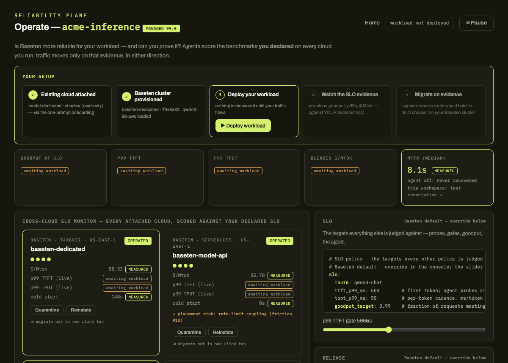
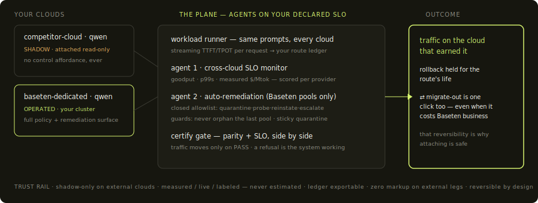

# Baseten Reliability Plane — operate console MVP

[](https://baseten-reliability-plane.vercel.app/operate)

**Live:** [baseten-reliability-plane.vercel.app](https://baseten-reliability-plane.vercel.app)

Reliability at Baseten today is something the platform does *for* customers —
MCM places, fails over, and heals, operator-first and invisible. This repo is
the reference implementation of the opposite surface: reliability as something
customers **declare** (four policy objects: Placement, Failover, Release, SLO)
and **operate** (one glanceable console where every enforcement decision is
visible and an agent with a closed action allowlist runs the remediations) —
MCM turned inside out. It is a static, Vercel-deployable MVP: no framework, no
build step, no backend, and a hard rule that every number on screen is either
measured from a committed recording or labeled simulated.



**Read the story in order** (one linear flow, no side hub):
[pain points](docs/friction-log.html) → [the turn](index.html#act2) →
[strategy](docs/strategy.html) → [PRD](docs/prd.html) →
[**the MVP doc**](docs/mvp.html) → [the console](operate.html).
The MVP doc is the richest piece: every feature mapped to the PRD, both
agentic workflows step by step, the live-run evidence, and complete
instructions for running this against real Baseten clusters.

## The two agentic workflows (how to drive them)

**Workflow 1 — migrate on SLO evidence** (the monitor recommends, you move):
open [the console](https://baseten-reliability-plane.vercel.app/operate) →
**▶ Deploy workload** (step 3 — nothing is measured until your traffic flows)
→ watch Agent 1's status strip score every cloud against the declared 500ms
voice gate → when a monitored route would hold your SLO cheaper on Baseten,
the win-back card appears and step 5 flips to **YOUR MOVE — Migrate now** →
shadow (mirrored requests) → certify (side-by-side vs your gates) → promote,
rollback armed for the route's life.

**Workflow 2 — auto-remediation under chaos** (the agent acts, you watch):
press **Inject chaos — degrade cluster-1** → Agent 2 detects the breach from
live samples, quarantines, traffic fails over per declared `spill_order`
(watch the rps move between pool cards), streaming probes verify recovery,
reinstate — the evidence card closes with **SLO CONTRACT INTACT ✓** priced
against your error budget. **Test the guard** proves it refuses to quarantine
the last healthy pool.

## We ran it live (2026-07-06) — real clusters, real migration

| pool | p50 TTFT | p99 TTFT vs 500ms gate | tok/s | $/Mtok measured | cold start |
| --- | --- | --- | --- | --- | --- |
| baseten-dedicated (T4, $0.90/hr) | 314ms | **330ms ✓** | 47.2 | **$5.31** | 108.7s (BDN) |
| competitor A100-80GB (~$3.40/hr) | 256ms | **22,863ms ✗** | 73.8 | $12.79 | 31.0s |

The bigger GPU lost the workload: its own cold boot blew the p99 — a dead
voice call — while the T4 held the gate at **−58% measured $/Mtok**. The
win-back fired on this evidence, 12 real mirrored pairs passed the certify
gate, the route promoted (rollback armed), and a chaos drill that became a
*real* permanent pool loss was carried by declared failover — the customer
route never went down. Raw evidence:
[`data/recorded/live_run_20260706.json`](data/recorded/live_run_20260706.json);
full write-up + run-it-yourself instructions: [docs/mvp.html](docs/mvp.html)
and [live/README.md](live/README.md).

## The story in three beats (why this repo looks like this)

1. **We onboarded to Baseten by hand and logged every friction** — 16 Baseten
   entries with committed evidence ([docs/friction-log.html](docs/friction-log.html)):
   silent capacity waits, un-triageable build failures, a production pointer
   left on a dead deploy. (The full 19-entry log in baseten-mvp also covers an
   adjacent RunPod pool; those entries are off-topic here.)
2. **Then we onboarded again through Baseten's own MCP server and agent
   skills — agentically — and the path worked** (evidence: `evals/mcp-deploy`
   in [baseten-mvp](https://github.com/vsiwach/baseten-mvp), MCP-read metrics
   CSVs in [`data/recorded/`](data/recorded/PROVENANCE.md)).
3. **This product gives that same technique to the customer**
   (act 2 on the landing page): one click unfolds the prompt that attaches
   their clouds read-only, baselines every route, and migrates traffic to
   Baseten — safely — when the evidence says so.

## The framing

Serious inference buyers already multi-home, and they're rightly suspicious of
a provider-owned control plane over their other clouds. So this plane starts
where trust starts: **read-only monitoring of every deployment you run, on any
provider** — one console for SLO adherence and measured $/Mtok. The ledger
that monitoring builds turns "considering moving traffic" into a **one-click
certified migration**, backed by rerunnable evidence instead of a bake-off
project. Control features apply only to Baseten-side workloads:
**observe → migrate → declare → operate**. The competitor cloud appears as the worked example
of a monitored external pool, not a bake-off target — and certified migration
is deliberately reversible (migrate-out is one click too), because no-lock-in
is what makes attaching your endpoints safe.

## JD mapping — Product Manager, Inference Platform

| JD outcome area | Where this repo demonstrates it | PRD |
| --- | --- | --- |
| Autoscaling to demand + **a single placement policy** (region, compliance regime, capacity preference, **right-of-way**) | Placement policy card + pool grid + placement feed: compliance-bound work is DENIED ordinary capacity, PREEMPTS filler on sensitive capacity (watch the feed), capacity-preference toggle changes where the next workload lands, cold-start seconds with mitigation on every pool card | F1.1, F1.3, F1.4 |
| **Multi-region / active-active and fallback as first-class policy** | Failover policy card (spill target toggle) + quarantine → spill in the feed + the #10 hazard scored on the spill target (rate-limit coupling prices the failover path honestly) | F1.5 |
| Traffic-shifting for **canary/shadow/A/B**, warm-ups, drain, probes | Release panel: gated canary with auto-rollback and a zero-drop drain counter; shadow is the first stage of every certified migration; both ported from a working router ([js/sim/release.js](js/sim/release.js), [migration.js](js/sim/migration.js)) | F1.2 |
| **Measurable decline in MTTR through self-serve incident management** | Incident panel: SLO-driven agent (closed allowlist, rendered in the UI), MTTR stopwatch, evidence card, replay of a **real recorded 8.8s incident**; recorded agent-off baseline: never recovered | F0.4, F2.1, F2.2 |

## Evidence — what's measured, what's simulated

Measured (chip → tooltip → committed file; see
[`data/recorded/PROVENANCE.md`](data/recorded/PROVENANCE.md)):

- **MTTR 8.1–9.2s** across 48 agent-on chaos drills (`chaos_drills.csv`); the
  console replays episode `ep-inc-0001-1783126701` (8.8s) verbatim. Every
  agent-off drill row is `resolved=False` — the manual baseline never
  recovered inside the drill window.
- **baseten-dedicated** (T4x8x32, vLLM, Qwen3-8B-AWQ): warm TTFT ~330ms, TPOT
  ~34ms/tok, cold start 360.4s → 148.2s after one BDN `weights:` stanza
  (friction #15/#17); $/Mtok = published $0.9024/hr ÷ measured 29.4 tok/s =
  **$8.53**.
- **baseten-model-api**: p50 TTFT 299ms, billed **$2.78/Mtok** (glm-4.7 sweep
  CSVs); the #10 hazard (28/40 requests 429'd, no `Retry-After`) is rendered
  as a placement risk on its pool card.
- The friction #18 pair: the same metrics call returning silent nulls at ~35s
  and true values at ~2min — why this console renders "no data yet (lag)",
  never zeros (`live_mcp_metrics_summary_*.json`).

Simulated (labeled everywhere): live traffic, drill timings, and the
`competitor-cloud` profile (representative of an external dedicated cloud —
record a real CSV with `bench/` and it upgrades to MEASURED).

### SLO/SLA comparison (provenance per cell, as rendered in the console)

| Pool | warm TTFT | TPOT | cold start | $/Mtok | published SLA |
| --- | --- | --- | --- | --- | --- |
| baseten-dedicated | 330ms · measured | 34ms/tok · measured | 148s (BDN) · measured | $8.53 · measured | 99.9% · published |
| baseten-model-api | 299ms · measured | 6.3ms/tok · measured | 0s (shared) · measured | $2.78 · measured (billed) | 99.9% · published |
| baseten-dedicated-2 | 330ms · measured | 34ms/tok · measured | 148s (BDN) · measured | $8.53 · measured | 99.9% · published |
| competitor-cloud | 280ms · simulated | 33ms/tok · simulated | 4s (snapshot) · simulated | $10.19 · simulated | 99.95% · published |

## What runs where

| Surface | What it is | How |
| --- | --- | --- |
| **[baseten-reliability-plane.vercel.app](https://baseten-reliability-plane.vercel.app)** | The **demo workspace**: a deterministic simulation of the exact live behavior — same console, same agent code, safe to click everything (chaos included) | just open it |
| **LIVE mode** | The same console operating **real clouds**: real Baseten activations via the management API, real streaming traffic, real chaos (deactivate/reactivate), real certified migration on mirrored requests | `export BASETEN_API_KEY=…` then `python3 live/bridge.py` + `python3 -m http.server 8431`; open `localhost:8431/operate.html` — badge flips to `LIVE` ([live/README.md](live/README.md)) |

One console, two data planes. The static site can hold no secrets and must never
expose real control (the chaos button deactivates a production deployment), so
keys and control stay in the local bridge — which is also how the real product
would ship: console anywhere, control plane where credentials live.

## Run it

```bash
open operate.html                 # works from file:// — no server needed
# or: python3 -m http.server 8431   → http://localhost:8431/operate.html
npm test                          # 46 unit tests for the pure sim core
```

Useful URLs: `operate.html?seed=42` (any seed is deterministic — same seed,
same event stream, asserted in `tests/determinism.test.js`),
`operate.html?nodata=cost` (kill a data source; the tile says "no data yet",
never zero).

**Refresh evidence** (one line per provider — see [`bench/README.md`](bench/README.md)):
`python3 bench/bench.py --url <openai-compatible>/v1 --model <m> --key $KEY --alias <pool> [-n 60] [--usd-hr <price>]`

**Deploy:** `vercel deploy` from the repo root (or point a Vercel project at
this repo — it's static files, no build step).

**Publish:** `gh repo create baseten-reliability-plane --public --source . --push`

## Architecture

```
js/sim/    pure, seeded, clock-injected state machines — every decision lives here
           prng · costs (measured-only: $/hr ÷ tok/s) · placement (right-of-way)
           release (canary/shadow, auto-rollback) · migration (shadow→certify→promote)
           agent (closed allowlist + guards) · incidents (phase clock, MTTR) · engine
js/ui/     panel renderers only — no decision logic in DOM code
js/data/   verbatim mirrors (policies as YAML strings, recorded operating points)
policies/  the four declared policy objects, YAML, human-readable
data/      byte-for-byte recorded evidence + PROVENANCE.md
tests/     node --test; determinism, both agent guards, monitor-only refusal
```

Two implementation notes, both deliberate: the sim files are classic scripts
with a CJS export shim (not ES modules) so `operate.html` opens from `file://`
in every browser with zero console errors while `node --test` imports the same
code; and `js/data/policies.js` embeds the YAML verbatim for the same reason —
a unit test fails if the mirror ever drifts from `policies/*.yaml`.

The agent's authority boundary is structural, not cosmetic: monitor-only pools
never get a case in the decision core
([js/sim/agent.js](js/sim/agent.js)), and
`tests/agent.test.js` proves the refusal — hiding buttons is not a security
model.

## Business value (qualitative, deliberately)

Faster evaluation (attach + baseline in a prompt, not a bake-off project) →
more certified migrations → higher dedicated utilization → SLA-ladder revenue
on reserved capacity; lower MTTR → retention. The quantified ROI model is
deliberately deferred: it needs internal context — pricing, capacity costs,
funnel conversion — and it is the first thing to build with business context
from inside.

## Lineage

- [`ai-native-pipeline`](https://github.com/vsiwach/ai-native-pipeline) — the
  release engine (canary/shadow/drain), the measured-cost ledger rule, the
  certified-migration state machine, and the design language this console inherits.
- [`baseten-mvp`](https://github.com/vsiwach/baseten-mvp) — the incident agent
  (ported faithfully, guards and all), the friction log, and every recorded
  file in `data/recorded/`.
- **Baseten's own rails**: this whole onboarding motion rides the Baseten MCP
  server + agent skills (shipped June 30, 2026). Baseten made the platform
  agent-operable before this plane existed; this MVP is the product those
  rails deserve.

MIT — see [LICENSE](LICENSE).
